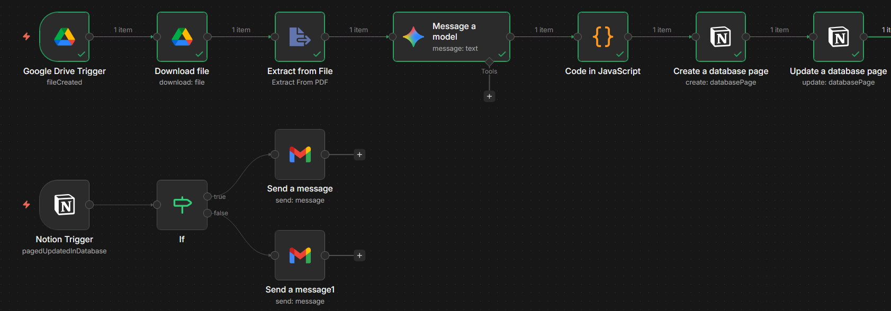
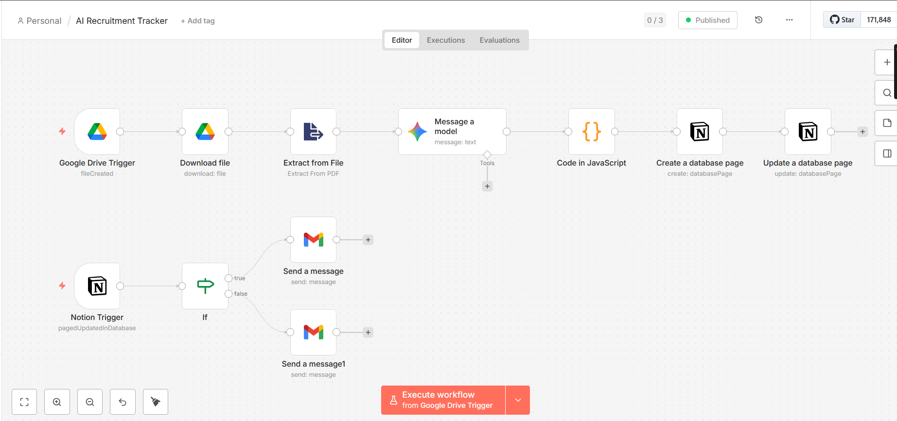
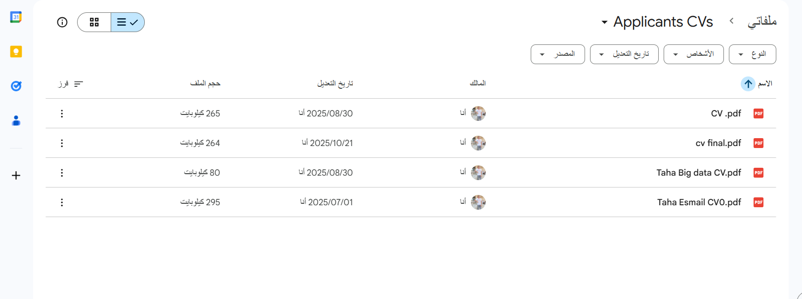
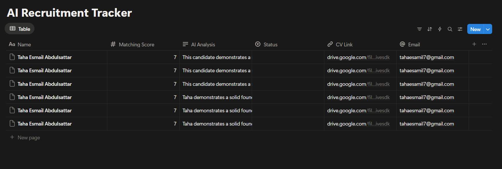

# 🚀 AI-Powered HR Recruitment Automator



An enterprise-grade automation workflow built with **n8n**, **Google Gemini AI**, and **Notion** to streamline the talent acquisition process. This system transforms raw CV uploads into a structured hiring pipeline with zero manual intervention.

---

## 📋 Table of Contents
* [Overview](#overview)
* [System Architecture](#system-architecture)
* [Key Features](#key-features)
* [Technical Challenges & Solutions](#technical-challenges--solutions)

---

## 🔍 Overview
This project automates the entire screening phase. It monitors a **Google Drive** folder for new CVs, uses **Gemini AI** to extract data and score candidates, logs everything into **Notion**, and triggers personalized **Gmail** communications based on the evaluation.

## 🏗️ System Architecture


The workflow follows a 4-stage pipeline:
1. **Trigger Stage:** Google Drive node detects new PDF/Docx uploads.
2. **Processing Stage:** Files are converted to text and sent to Gemini AI for analysis.
3. **Parsing Stage:** A custom JavaScript node sanitizes the AI response and converts it into a valid JSON object.
4. **Action Stage:** Data is synced to Notion, and if a candidate is marked for an "Interview", an automated email is sent via Gmail.

---

## ✨ Visual Proof of Work

| 📂 Drive Trigger | 📊 Notion Database | 📧 Gmail Automation |
| :---: | :---: | :---: |
|  |  |  |
| *Detecting CVs* | *Scoring & Tracking* | *Personalized Response* |

---

## 🛠️ Technical Challenges & Solutions

### 1. Handling Undefined AI Responses
* **Issue:** The AI output path sometimes varied, leading to "Cannot read property of undefined" errors.
* **Solution:** Implemented **Optional Chaining (`?.`)** in JavaScript to ensure the system never crashes on empty inputs.

### 2. JSON Sanitation
* **Issue:** Gemini often wrapped JSON in Markdown code blocks (```json), which native nodes couldn't parse.
* **Solution:** Developed a cleaning script to strip Markdown tags and extract pure JSON objects using `.replace()` and `.trim()`.

---

**Developed with ❤️ by Taha Esmail Abdulsattar**
